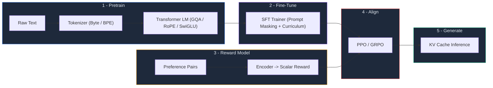

<p align="center">
  <h1 align="center">⚛️ Atlas</h1>
  <p align="center">
    <strong>A production-grade LLM framework built entirely from scratch in PyTorch.</strong>
  </p>
  <p align="center">
    Covers the <em>full lifecycle</em>: Pretraining → SFT → Reward Modeling → RLHF (PPO & GRPO) → Inference
  </p>
  <p align="center">
    <a href="https://www.python.org/downloads/"></a>
    <a href="https://pytorch.org/"></a>
    <a href="LICENSE"></a>
    <a href="#tests"></a>
  </p>
</p>

---

> [!CAUTION]
> **Performance Warning**: Atlas is a precision engine, but its output quality is strictly dependent on effective hyperparameter tuning. Users must proactively adjust learning rates, batch sizes, and model dimensions (QGa heads, expert counts) to suit their specific data. Using the basic default configuration for complex tasks *will* result in sub-par performance and poor convergence. Tuning is not optional; it is fundamental.

---

## ✨ Enterprise-Grade LLM Infrastructure

Atlas is a high-performance, decoder-only Transformer framework engineered for the full model lifecycle. While most implementations provide only the base model, Atlas delivers an integrated pipeline from raw data to RLHF-aligned production agents.

### Core Capabilities

| Category | Product Highlights |
|---|---|
| 🏗️ **Architecture** | Scalable Transformer with GQA, RoPE, SwiGLU, RMSNorm, and Attention Sinks for infinite-context stability. |
| 🧠 **Mixture of Experts** | Production-ready MoE support with Top-k gating, load-balancing, and hybrid dense+sparse blending. |
| ⚡ **Performance** | Native AMP (Mixed Precision), gradient accumulation, and optimized AdamW for maximum throughput. |
| 🎯 **Alignment** | Professional-grade SFT with prompt masking, Bradley-Terry reward modeling, PPO, and GRPO. |
| 🔮 **Inference** | Low-latency KV-cache generation with advanced sampling (Top-K/P) and early EOS detection. |
| 📊 **Observability** | Native integration with TensorBoard and Weights & Biases for industrial monitoring. |
| 🧪 **Reliability** | Comprehensive test suite (60+ units) ensuring mathematical correctness and training stability. |

---

## 📐 Architecture



---

## 🚀 Quick Start

### Installation

```bash
git clone https://github.com/arnav-chauhan-kgpian/atlas.git
cd atlas
python -m venv venv && venv\Scripts\activate   # Windows
# source venv/bin/activate                     # macOS / Linux
pip install -e ".[dev]"
```

### End-to-End Pipeline in 5 Commands

```bash
# 1️⃣  Pretrain on raw text
atlas-train --data data/tiny.txt --steps 500 --tokenizer byte \
  --block-size 128 --n-layer 2 --n-head 2 --n-embd 64

# 2️⃣  Supervised fine-tuning
atlas-sft --ckpt runs/pretrain/model_last.pt --steps 100

# 3️⃣  Train a reward model
atlas-rm --steps 200

# 4️⃣  RLHF alignment (pick one)
atlas-ppo  --policy-ckpt runs/sft/model_last.pt --reward-ckpt runs/rm/model_last.pt --steps 50
# atlas-grpo --policy-ckpt runs/sft/model_last.pt --reward-ckpt runs/rm/model_last.pt --steps 50

# 5️⃣  Generate text
atlas-sample --ckpt runs/rl/model_last.pt --prompt "Explain transformers"
```

---

## 📖 Model Lifecycle & Operations

<details>
<summary><strong>Stage 1: Foundation Pretraining</strong></summary>

Execute large-scale pretraining on raw text corpora using next-token prediction.

```bash
# Efficient baseline — byte tokenizer, 0.1M parameter model
atlas-train --data data/tiny.txt --steps 100 --tokenizer byte \
  --block-size 128 --n-layer 2 --n-head 2 --n-embd 64

# Production-scale — BPE tokenizer, AMP enabled, gradient accumulation
atlas-train --data data/corpus.txt --steps 5000 --tokenizer bpe \
  --block-size 256 --n-layer 6 --n-head 8 --n-embd 512 --amp

# Configuration-driven execution
atlas-train --config configs/pretrain_small.yaml --data data/corpus.txt
```

**Operational Mechanics:**
- **Dynamic Tokenization**: Automatic BPE training or Zero-config Byte-level encoding.
- **Optimization**: Warmup-cosine learning rate scheduling with weight decay.
- **Persistence**: Atomic checkpoint saving with rolling garbage collection.
- **Monitoring**: Real-time telemetry via TensorBoard and sample generation during training.
- **Robustness**: Signal-aware graceful shutdown; saves state on interrupt.

**Artifact:** `runs/pretrain/model_last.pt`

</details>

<details>
<summary><strong>Stage 2: Supervised Alignment (SFT)</strong></summary>

Align foundation models with instruction-response pairs. Uses prompt-masking to ensure the model optimizes strictly for response generation.

```bash
atlas-sft --ckpt runs/pretrain/model_last.pt --steps 200

# High-precision alignment
atlas-sft --ckpt runs/pretrain/model_last.pt --steps 500 --lr 1e-4 --out runs/sft
```

**Operational Mechanics:**
- **Instruction Ingestion**: Native support for Alpaca-style datasets.
- **Length Curriculum**: Sequentially increases sequence length for training stability.
- **Loss Masking**: Prompt tokens are excluded from gradients; no "forgetting" of base knowledge.

**Artifact:** `runs/sft/model_last.pt`

</details>

<details>
<summary><strong>Stage 3: Reward Modeling</strong></summary>

Develop a scoring head to quantify completion quality, enabling subsequent RLHF alignment.

```bash
atlas-rm --steps 500 --out runs/rm

# Margin-based preference optimization
atlas-rm --steps 500 --loss margin
```

**Operational Mechanics:**
- **Preference Optimization**: Trains on binary choice pairs (Chosen vs. Rejected).
- **Bradley-Terry Formalism**: Optimizes `−log σ(r_chosen − r_rejected)` for robust scoring.

**Artifact:** `runs/rm/model_last.pt`

</details>

<details>
<summary><strong>Stage 4a: Policy Optimization (PPO)</strong></summary>

Directly optimize the SFT policy via Proximal Policy Optimization, leveraging the reward model for ground-truth signal while maintaining KL-divergence constraints.

```bash
atlas-ppo \
  --policy-ckpt runs/sft/model_last.pt \
  --reward-ckpt runs/rm/model_last.pt \
  --steps 100 --kl-coef 0.01
```

**Operational Mechanics:**
- **Dual-Model Architecture**: Manages Actor (Policy) and Critic (Value) networks.
- **Constraint Satisfaction**: Clipped objective functions with adaptive KL penalties.

**Artifact:** `runs/rl/model_last.pt`

</details>

<details>
<summary><strong>Stage 4b: Group Relative Alignment (GRPO)</strong></summary>

Scale alignment without the overhead of a value-head using group-relative baseline baselines.

```bash
atlas-grpo \
  --policy-ckpt runs/sft/model_last.pt \
  --reward-ckpt runs/rm/model_last.pt \
  --steps 100 --group-size 4 --kl-coef 0.01
```

**Operational Mechanics:**
- **Relative Advantage**: Computes advantage across a cohort of completions.
- **Resource Efficiency**: Eliminates Value-network parameters, reducing VRAM footprint.

**Artifact:** `runs/rl/model_last.pt`

</details>

<details>
<summary><strong>Stage 5: Production Inference</strong></summary>

```bash
# Real-time generation from any aligned checkpoint
atlas-sample --ckpt runs/rl/model_last.pt --prompt "Executive Summary of the project"

# Advanced Sampling Control
atlas-sample --ckpt runs/sft/model_last.pt \
  --prompt "Technical breakdown of Transformer blocks" \
  --tokens 200 --temperature 0.8 --top-k 40 --top-p 0.95
```

</details>

---

## ⚙️ Industrial Configuration

Atlas utilizes a hierarchical configuration system. YAML definitions provide the baseline, while CLI overrides allow for rapid experimentation.

```yaml
# configs/pretrain_small.yaml
model:
  vocab_size: 32000
  block_size: 256
  n_layer: 6
  n_head: 8
  n_embd: 512
  n_kv_head: 4          # GQA Implementation
  use_rmsnorm: true
  use_swiglu: true
  rope: true

train:
  steps: 2000
  batch_size: 32
  lr: 3e-4
  grad_accum_steps: 4
  warmup_steps: 20
  mixed_precision: true
  tokenizer_type: bpe
  log_backend: wandb       # Industrial-grade logging
  save_every: 200
```

---

## 🧩 Integration & Custom Workflows

Atlas is designed for extensibility as a core library.

```python
from atlas.config import ModelConfig
from atlas.model.transformer import Transformer
from atlas.data.tokenizer import ByteTokenizer
import torch

# Instantiate a production-grade Transformer
config = ModelConfig(vocab_size=256, block_size=128, n_layer=4, n_head=4, n_embd=512)
model = Transformer(config)

# Pipeline-integrated generation
tokenizer = ByteTokenizer()
token_ids = torch.tensor([tokenizer.encode("System initialization...")])
completion = model.generate(token_ids, max_new_tokens=50, temperature=0.7)
print(tokenizer.decode(completion[0].tolist()))
```

```python
# Direct checkpoint-to-inference bridge
from atlas.inference.generate import generate_from_checkpoint

response = generate_from_checkpoint(
    "runs/pretrain/model_last.pt",
    prompt="Design specifications for the new engine:",
    max_new_tokens=100,
)
print(response)
```


---

## 🏛️ Project Structure

```
atlas/
├── model/                  # Core architecture
│   ├── transformer.py      #   Full decoder-only Transformer
│   ├── attention.py        #   GQA + RoPE + Flash (SDPA) + sliding window
│   ├── block.py            #   Pre-norm Transformer block
│   ├── ffn.py              #   SwiGLU / GELU feed-forward
│   ├── moe.py              #   Mixture-of-Experts (TopK gating, hybrid blend)
│   ├── norm.py             #   RMSNorm + LayerNorm factory
│   ├── rope.py             #   Rotary Positional Embeddings
│   ├── kv_cache.py         #   KV cache + rolling buffer with attention sinks
│   ├── policy.py           #   PolicyWithValue wrapper for PPO
│   └── reward.py           #   Reward model (encoder → scalar)
│
├── training/               # Training infrastructure
│   ├── trainer.py          #   Main pretraining loop
│   ├── optimizer.py        #   AdamW + AMP gradient scaler
│   ├── scheduler.py        #   Warmup-cosine LR scheduler
│   ├── checkpointing.py    #   Atomic save, rolling GC, architecture verification
│   └── logger.py           #   TensorBoard + W&B logger
│
├── alignment/              # Post-training alignment
│   ├── sft.py              #   Supervised fine-tuning (prompt masking + curriculum)
│   ├── reward.py           #   Reward model trainer
│   ├── ppo.py              #   Proximal Policy Optimization
│   ├── grpo.py             #   Group Relative Policy Optimization
│   └── rollout.py          #   Rollout buffer for RL
│
├── data/                   # Data pipeline
│   ├── tokenizer.py        #   Byte + BPE tokenizer (HuggingFace tokenizers)
│   ├── dataset.py          #   Text dataset + DataLoader factory
│   ├── sft.py              #   SFT instruction data with prompt masking
│   └── preferences.py      #   Preference pair data for reward training
│
├── inference/              # Generation
│   └── generate.py         #   Checkpoint → text generation (auto-detects PPO models)
│
├── cli/                    # Command-line interfaces
│   ├── pretrain.py         #   atlas-train
│   ├── finetune.py         #   atlas-sft
│   ├── reward.py           #   atlas-rm
│   ├── rl.py               #   atlas-ppo / atlas-grpo
│   └── sample.py           #   atlas-sample
│
├── config.py               # Unified dataclass configs (Model, Train, SFT, RM, RL)
│
configs/                    # Example YAML configs
tests/                      # 60+ pytest unit tests
data/                       # Sample training data
```

---

## 🧪 Tests

```bash
# Run the full test suite
python -m pytest tests/ -v

# With coverage
python -m pytest tests/ -v --cov=atlas
```

The suite includes **60+ tests** covering:
- Model forward/backward passes and shape verification
- MoE gating, expert routing, and aux loss
- Tokenizer encoding/decoding round-trips
- Checkpoint save/load and architecture verification
- SFT prompt masking, reward model training, PPO/GRPO steps

---

## 🤝 Contributing

Contributions are welcome! See [CONTRIBUTING.md](CONTRIBUTING.md) for guidelines.

---

## 📄 License

This project is licensed under the **GNU General Public License v3.0** — see the [LICENSE](LICENSE) file for details.

---

<p align="center">
  <sub>Built with ❤️ by Arnav Chauhan, IIT Kharagpur</sub>
</p>
